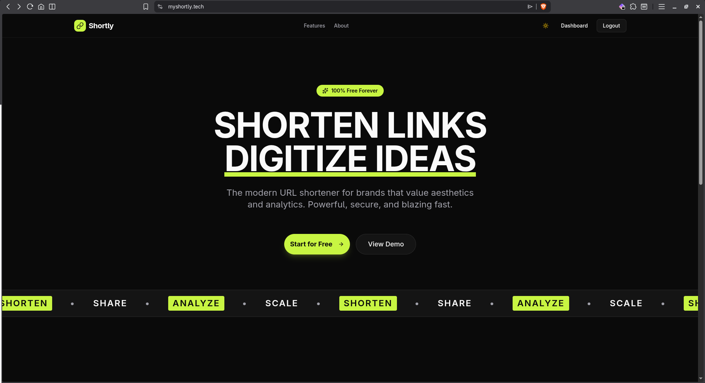
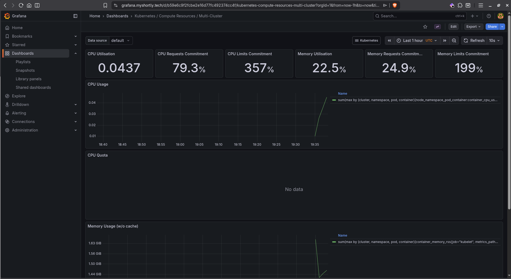
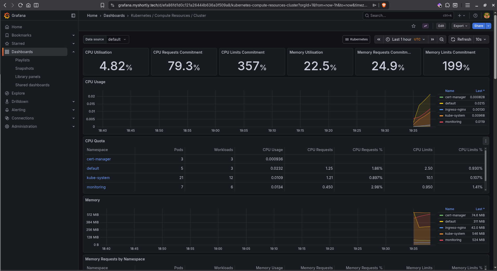

# Shortly — URL Shortener

A production-grade URL shortener deployed on **Azure Kubernetes Service** with a full DevOps pipeline.

> **Domain**: [myshortly.tech](https://myshortly.tech)

---

## Architecture

```
Developer → GitLab CI (Test, Build, Scan) → Azure Container Registry
                                                      │
                                                      ▼
                                              Azure Kubernetes Service
                                           ┌─────────────────────────┐
                                           │  NGINX Ingress (TLS)    │
                                           │  ┌───────┐ ┌─────────┐  │
                                           │  │  /api │ │    /    │  │
                                           │  └───┬───┘ └────┬────┘  │
                                           │      ▼          ▼       │
                                           │  Backend    Frontend    │
                                           │  (Elysia)   (Next.js)   │
                                           │      │                  │
                                           │      ▼                  │
                                           │    Redis                │
                                           └──────┼──────────────────┘
                                                  │
                                                  ▼
                                           MongoDB Atlas (External)
```

---

## Tech Stack

### Application

| Component    | Technology                           |
| ------------ | ------------------------------------ |
| **Backend**  | Bun + Elysia (TypeScript)            |
| **Frontend** | Next.js 16, React 19, Tailwind CSS 4 |
| **Database** | MongoDB Atlas                        |
| **Cache**    | Redis (in-cluster)                   |
| **Auth**     | JWT + bcrypt, RBAC                   |

### DevOps

| Category               | Tool                           | Status         |
| ---------------------- | ------------------------------ | -------------- |
| **Cloud Provider**     | Azure                          | ✅ Implemented |
| **Container Registry** | Azure Container Registry (ACR) | ✅ Implemented |
| **Kubernetes**         | Azure Kubernetes Service (AKS) | ✅ Implemented |
| **IaC**                | Terraform                      | ✅ Implemented |
| **CI/CD (Build)**      | GitLab CI                      | ✅ Implemented |
| **Package Manager**    | Helm                           | ✅ Implemented |
| **Secrets**            | Bitnami Sealed Secrets         | ✅ Implemented |
| **Ingress**            | NGINX Ingress Controller       | ✅ Implemented |
| **HPA**                | Horizontal Pod Autoscaler      | ✅ Implemented |
| **Security Scanning**  | Trivy                          | ✅ Implemented |
| **TLS**                | cert-manager + Let's Encrypt   | ✅ Implemented |
| **Static IP**          | Terraform-managed Public IP    | ✅ Implemented |
| **Monitoring**         | Prometheus + Grafana           | ✅ Implemented |
| **CI/CD (GitOps)**     | ArgoCD                         | 🔄 In Progress |

---

## Project Structure

```
shortly_url_shortener/
├── backend/                    # Bun + Elysia REST API
│   ├── Dockerfile              # Multi-stage build (test → prod)
│   ├── src/
│   │   ├── index.ts            # App entrypoint + Swagger spec
│   │   ├── config/             # DB, Redis, env config
│   │   ├── controllers/        # Admin controller
│   │   ├── middleware/          # Auth, RBAC, rate-limit, security
│   │   ├── models/             # Mongoose models (User, Url)
│   │   ├── routes/             # Auth, URL CRUD, redirect, admin
│   │   ├── services/           # Redis, shortcode, URL services
│   │   └── tests/              # Unit tests
│   └── package.json
│
├── frontend/                   # Next.js 16 app
│   ├── Dockerfile              # Multi-stage build with build-args
│   ├── src/
│   │   ├── app/                # Pages (auth, dashboard, admin, redirect)
│   │   ├── components/         # UI components (shadcn/ui)
│   │   ├── lib/                # API client, config, utils
│   │   └── providers/          # Auth, Query, Theme providers
│   └── package.json
│
├── DevOps/
│   ├── terraform/              # Azure infrastructure
│   │   ├── provider.tf         # AzureRM provider + remote backend
│   │   ├── main.tf             # AKS, ACR, node pools, role assignment, static IP
│   │   ├── variables.tf        # K8s version, VM size, OS SKU
│   │   └── outputs.tf          # Cluster name, ACR URL, kubeconfig, static IP
│   │
│   └── k8s/
│       ├── nginx-ingress-values.yaml      # NGINX Ingress Controller config
│       ├── prometheus-stack-values.yaml   # Prometheus + Grafana config
│       └── shorly/             # Application Helm chart
│           ├── Chart.yaml
│           ├── values.yaml     # Image tags, replicas, resources, ingress, TLS
│           └── templates/
│               ├── backend_deployment.yaml
│               ├── frontend_deployment.yaml
│               ├── redis.yaml
│               ├── service.yaml        # ClusterIP services
│               ├── ingress.yaml        # NGINX ingress with TLS
│               ├── cluster-issuer.yaml # Let's Encrypt ClusterIssuer
│               ├── HPA.yaml            # Autoscaling (2–5 pods)
│               └── sealed-secret.yaml
│
└── .gitlab-ci.yml              # CI/CD pipeline
```

---

## Backend API

| Endpoint                         | Method | Auth   | Description              |
| -------------------------------- | ------ | ------ | ------------------------ |
| `/health`                        | GET    | —      | Health check (+ Redis)   |
| `/swagger`                       | GET    | —      | Swagger UI               |
| `/api/auth/register`             | POST   | —      | Register user            |
| `/api/auth/login`                | POST   | —      | Login (returns JWT)      |
| `/api/auth/me`                   | GET    | Bearer | Current user profile     |
| `/api/auth/delete-account`       | DELETE | Bearer | Delete account           |
| `/api/urls`                      | POST   | Bearer | Create short URL         |
| `/api/urls`                      | GET    | Bearer | List user's URLs         |
| `/api/urls/:shortCode/analytics` | GET    | Bearer | URL click analytics      |
| `/api/urls/:shortCode`           | DELETE | Bearer | Delete URL               |
| `/:shortCode`                    | GET    | —      | Redirect to original URL |

---

## Infrastructure

### Terraform Resources

| Resource              | Config                                                |
| --------------------- | ----------------------------------------------------- |
| **Resource Group**    | `shortly-prod`, West Europe                           |
| **AKS Cluster**       | Standard tier, OIDC enabled, system-assigned identity |
| **Default Node Pool** | Autoscale 1–2 nodes, 3 AZs, `Standard_D2ads_v7`       |
| **Worker Node Pool**  | Autoscale 1–6 nodes, 3 AZs, User mode                 |
| **ACR**               | Standard SKU, `AcrPull` role assigned to AKS kubelet  |
| **Static Public IP**  | Standard SKU, assigned to NGINX Ingress Controller    |
| **TF State Backend**  | Azure Storage Account (`shortlytfstate/tfstate`)      |

### Kubernetes Resources

- **Deployments**: Backend (2 replicas), Frontend (2 replicas), Redis (1 replica)
- **Services**: ClusterIP for all three
- **Ingress**: NGINX — routes `/api` to backend, `/` to frontend on `myshortly.tech`
- **TLS**: cert-manager + Let's Encrypt (auto-provisioned & auto-renewed)
- **ClusterIssuer**: Let's Encrypt production with HTTP-01 solver
- **Monitoring**: Prometheus + Grafana at [grafana.myshortly.tech](https://grafana.myshortly.tech) with TLS
- **HPA**: Frontend & backend scale 2→5 pods on CPU (60%) or memory (70%)
- **Sealed Secrets**: All env vars encrypted with Bitnami Sealed Secrets
- **Probes**: Liveness & readiness on all deployments

---

## CI/CD Pipeline (GitLab CI)

### Stages

```
test  →  infra  →  build  →  scan  →  deploy
```

### Workflow Rules

- Runs for **merge request pipelines**
- Runs for **default branch** pushes

### Jobs

| Job                       | Stage  | Rules/Notes                        | Description                                                                     |
| ------------------------- | ------ | ---------------------------------- | ------------------------------------------------------------------------------- |
| `test_frontend`           | test   | Template job                       | `bun install` → `bun run lint` → `bun run typecheck` in `frontend/`             |
| `test_backend`            | test   | Template job                       | `bun install` → `bun test` → `bun run lint` → `bun run typecheck` in `backend/` |
| `infra_plan`              | infra  | Always (per workflow rules)        | `terraform plan -out=tfplan` in `DevOps/terraform/`                             |
| `infra_apply`             | infra  | Template job, needs `infra_plan`   | `terraform apply` then exports outputs to `DevOps/deploy.env` (dotenv)          |
| `build_and_push_backend`  | build  | Template job                       | Docker build → push to ACR (`:$COMMIT_SHA` + `:latest`)                         |
| `build_and_push_frontend` | build  | Template job                       | Docker build with `NEXT_PUBLIC_*` args → push to ACR                            |
| `push_redis_to_acr`       | build  | Default branch only, allow_failure | Mirror hardened `redis` from `dhi.io` to ACR                                    |
| `scan_backend`            | scan   | Template job                       | Trivy scan for CRITICAL vulns → JSON report artifact                            |
| `scan_frontend`           | scan   | Template job                       | Trivy scan for CRITICAL vulns → JSON report artifact                            |
| `deploy_to_aks`           | deploy | Default branch only                | Azure CLI login → ingress/cert-manager/sealed-secrets/monitoring → Helm upgrade |

---

## Roadmap (In Progress)

### ArgoCD (GitOps) 🔄

- Install ArgoCD on AKS
- Connect to GitLab repository
- Create ArgoCD Application pointing to Helm chart
- Configure auto-sync with self-heal and auto-prune
- Separate CI (GitLab) from CD (ArgoCD)

---

## Local Development

```bash
# Backend
cd backend
bun install
bun run dev          # http://localhost:3002

# Frontend
cd frontend
bun install
bun run dev          # http://localhost:3000
```

---

## Environment Variables

Managed via **Sealed Secrets** in the cluster. Key variables:

| Variable               | Description                     |
| ---------------------- | ------------------------------- |
| `MONGODB_URI`          | MongoDB Atlas connection string |
| `JWT_SECRET`           | JWT signing secret              |
| `JWT_EXPIRES_IN`       | Token expiry                    |
| `REDIS_URL`            | Redis connection URL            |
| `REDIS_PASSWORD`       | Redis auth password             |
| `REDIS_ENABLED`        | Enable/disable Redis cache      |
| `FRONTEND_URL`         | CORS origin                     |
| `NEXT_PUBLIC_API_URL`  | Backend URL for frontend        |
| `NEXT_PUBLIC_BASE_URL` | Base URL for short links        |
| `PORT`                 | Backend port (3002)             |
| `NODE_ENV`             | Environment (production)        |

## Screenshots

### Homepage



### Grafana Monitoring




### Demo

## [🎬 Watch the demo video](Output/Demo.mp4)
