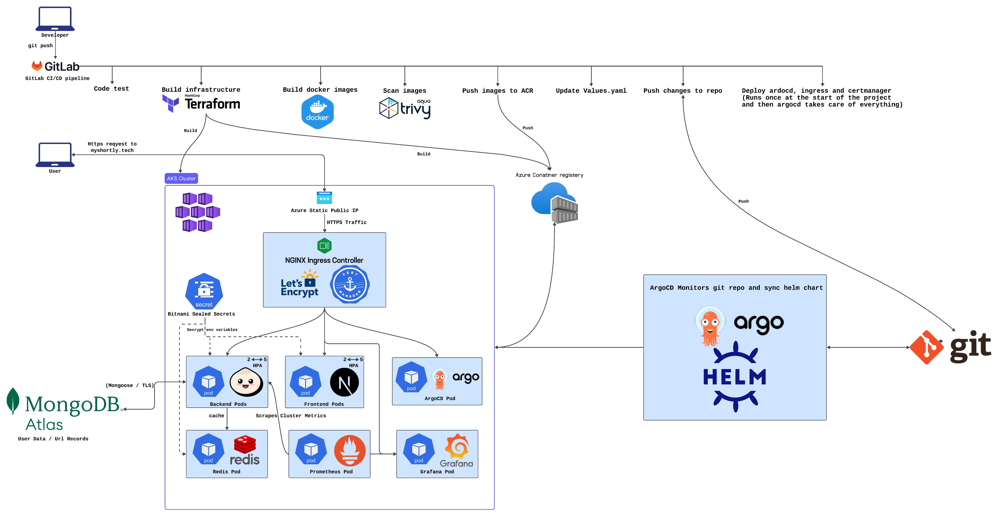
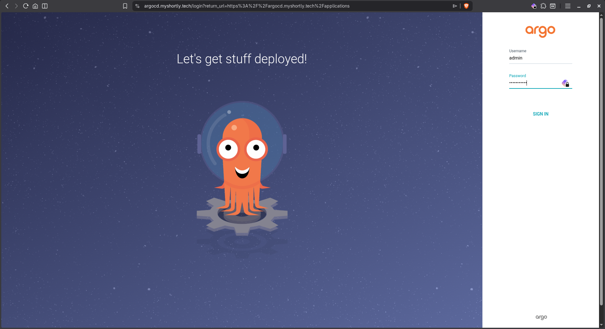
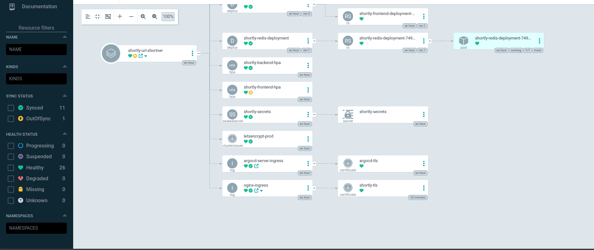

# Shortly — URL Shortener

A production-grade, cloud-native URL shortener built with a modern TypeScript stack and deployed on **Azure Kubernetes Service** using a full **GitOps** pipeline.

> 🌐 **Domain**: `myshortly.tech` &nbsp;|&nbsp; 🔄 **ArgoCD**: `argocd.myshortly.tech` &nbsp;|&nbsp; 📊 **Grafana**: `grafana.myshortly.tech`
>
> _Infrastructure was deployed on Azure for testing and demonstration — currently torn down to save costs._

---

## Architecture



---

## Tech Stack

### Application

| Component    | Technology                           |
| ------------ | ------------------------------------ |
| **Backend**  | Bun + Elysia (TypeScript)            |
| **Frontend** | Next.js 16, React 19, Tailwind CSS 4 |
| **Database** | MongoDB Atlas                        |
| **Cache**    | Redis (in-cluster)                   |
| **Auth**     | JWT + bcrypt, RBAC                   |

### Infrastructure & DevOps

| Category               | Tool / Service                 | Purpose                                                    |
| ---------------------- | ------------------------------ | ---------------------------------------------------------- |
| **Cloud Provider**     | Microsoft Azure                | Resource Group, networking, identity management            |
| **Compute**            | Azure Kubernetes Service (AKS) | Managed K8s with system + user node pools, 3 AZs           |
| **Container Registry** | Azure Container Registry (ACR) | Private Docker image storage with `AcrPull` role binding   |
| **IaC**                | Terraform                      | Provisions AKS, ACR, static IP, role assignments           |
| **State Backend**      | Azure Storage Account          | Remote Terraform state (`shortlytfstate/tfstate`)          |
| **CI Pipeline**        | GitLab CI/CD                   | Test → Build → Scan → Update manifests (6 stages)          |
| **CD / GitOps**        | ArgoCD + Helm                  | Auto-sync from Git with prune, self-heal, retry            |
| **Ingress**            | NGINX Ingress Controller       | TLS termination, host & path-based routing                 |
| **TLS Certificates**   | cert-manager + Let's Encrypt   | Auto-provisioned & auto-renewed HTTPS (ACME HTTP-01)       |
| **Static IP**          | Azure Public IP (Terraform)    | Stable IP for DNS — survives pod/node restarts             |
| **Secrets Management** | Bitnami Sealed Secrets         | Encrypted secrets in Git, decrypted only in-cluster        |
| **Autoscaling**        | Horizontal Pod Autoscaler      | Frontend & Backend: 2→5 pods (CPU 60% / Memory 70%)        |
| **Security Scanning**  | Trivy                          | Container image vulnerability scanning (CRITICAL severity) |
| **Monitoring**         | Prometheus + Grafana           | Cluster metrics scraping + dashboards with TLS             |
| **Health Checks**      | Liveness & Readiness Probes    | Automatic restart on failure, traffic routing on readiness |
| **Multi-stage Builds** | Docker                         | Optimized images (test stage → production stage)           |

---

## CI/CD Pipeline

### Pipeline Stages

```
Code Test → Build Infrastructure → Build Docker Images → Scan Images → Update Manifests → Deploy Infrastructure
```

### GitOps Flow

```
Developer pushes code
        │
        ▼
  GitLab CI Pipeline
  ┌─────────────────────────────────────────────────────────────────────┐
  │  1. Test        ─  lint, typecheck, unit tests                      │
  │  2. Infra       ─  terraform plan + apply (AKS, ACR, IP, roles)     │
  │  3. Build       ─  Docker multi-stage build → push to ACR           │
  │  4. Scan        ─  Trivy CRITICAL vulnerability scan                │
  │  5. Manifests   ─  yq updates values.yaml with new image SHA        │
  │                    git commit [skip ci] → push to main              │
  │  6. Deploy      ─  Install NGINX, cert-manager, Sealed Secrets,     │
  │                    Prometheus, ArgoCD (idempotent, first-run only)  │
  └─────────────────────────────────────────────────────────────────────┘
        │
        ▼  (values.yaml updated in Git)
  ArgoCD detects change → Syncs Helm chart → Deploys to AKS
```

### Jobs

| Job                       | Stage          | Description                                                          |
| ------------------------- | -------------- | -------------------------------------------------------------------- |
| `test_frontend`           | test           | `bun install` → lint → typecheck                                     |
| `test_backend`            | test           | `bun install` → test → lint → typecheck                              |
| `infra_plan`              | infra          | `terraform plan -out=tfplan`                                         |
| `infra_apply`             | infra          | `terraform apply` → exports outputs to `dotenv`                      |
| `build_and_push_backend`  | build          | Multi-stage Docker build → push to ACR (`:$SHA` + `:latest`)         |
| `build_and_push_frontend` | build          | Docker build with `NEXT_PUBLIC_*` build args → push to ACR           |
| `push_redis_to_acr`       | build          | Mirror hardened Redis image to ACR                                   |
| `scan_backend`            | scan           | Trivy CRITICAL scan → JSON report artifact                           |
| `scan_frontend`           | scan           | Trivy CRITICAL scan → JSON report artifact                           |
| `push_to_repo`            | edit_manifests | `yq` updates image tags in `values.yaml` → `git commit [skip ci]`    |
| `deploy_to_aks`           | deploy         | Installs NGINX / cert-manager / Sealed Secrets / Prometheus / ArgoCD |

### ArgoCD Configuration

| Setting              | Value                                                |
| -------------------- | ---------------------------------------------------- |
| **Source**           | `DevOps/k8s/shorly` (Helm chart in this repo)        |
| **Auto-sync**        | Enabled — prune, selfHeal                            |
| **Retry**            | 5 attempts with backoff                              |
| **Sync Options**     | `CreateNamespace`, `PruneLast`, `ApplyOutOfSyncOnly` |
| **Revision History** | 10 rollbacks kept                                    |

---

## Infrastructure

### Terraform-Managed Azure Resources

| Resource                     | Configuration                                                  |
| ---------------------------- | -------------------------------------------------------------- |
| **Resource Group**           | `shortly-prod`, West Europe                                    |
| **AKS Cluster**              | Standard tier, OIDC enabled, system-assigned managed identity  |
| **System Node Pool**         | Autoscale 1–2 nodes, 3 Availability Zones                      |
| **User Node Pool**           | Autoscale 1–6 nodes, 3 Availability Zones, `Standard_D2ads_v7` |
| **Azure Container Registry** | Standard SKU, `AcrPull` role assigned to AKS kubelet identity  |
| **Azure Public IP**          | Standard SKU, static, assigned to NGINX Ingress LoadBalancer   |
| **Network Contributor Role** | AKS identity → Resource Group (enables IP binding to LB)       |
| **Remote State**             | Azure Storage Account (`shortlytfstate/tfstate`)               |

### Kubernetes Resources

| Resource                | Details                                                         |
| ----------------------- | --------------------------------------------------------------- |
| **Backend Deployment**  | 2 replicas, Bun + Elysia, liveness & readiness probes           |
| **Frontend Deployment** | 2 replicas, Next.js SSR, liveness & readiness probes            |
| **Redis Deployment**    | 1 replica, password-protected, persistent cache                 |
| **ClusterIP Services**  | Backend (3002), Frontend (3000), Redis (6379)                   |
| **App Ingress**         | `myshortly.tech` — `/api` → Backend, `/` → Frontend             |
| **ArgoCD Ingress**      | `argocd.myshortly.tech` → argocd-server (HTTP backend protocol) |
| **Grafana Ingress**     | `grafana.myshortly.tech` → Grafana dashboard                    |
| **ClusterIssuer**       | Let's Encrypt production, ACME HTTP-01 solver                   |
| **TLS Certificates**    | Auto-provisioned per ingress, auto-renewed by cert-manager      |
| **HPA (Backend)**       | 2→5 pods, CPU threshold 60%, Memory threshold 70%               |
| **HPA (Frontend)**      | 2→5 pods, CPU threshold 60%, Memory threshold 70%               |
| **Sealed Secrets**      | Encrypted in Git, decrypted at deploy time by controller        |

---

## Project Structure

```
shortly-url-shortener/
├── backend/                         # Bun + Elysia REST API
│   ├── Dockerfile                   # Multi-stage: test → production
│   └── src/
│       ├── index.ts                 # App entrypoint + Swagger
│       ├── config/                  # DB, Redis, environment
│       ├── controllers/             # Admin controller
│       ├── middleware/              # Auth, RBAC, rate-limit, security headers
│       ├── models/                  # Mongoose models (User, Url)
│       ├── routes/                  # Auth, URLs, redirect, admin
│       ├── services/               # Redis, shortcode, URL services
│       └── tests/                  # Unit tests
│
├── frontend/                        # Next.js 16 app
│   ├── Dockerfile                   # Multi-stage with build args
│   └── src/
│       ├── app/                    # Pages (auth, dashboard, admin)
│       ├── components/             # UI components (shadcn/ui)
│       ├── lib/                    # API client, config, utils
│       └── providers/              # Auth, Query, Theme providers
│
├── DevOps/
│   ├── terraform/                   # Infrastructure as Code
│   │   ├── provider.tf             # AzureRM provider + remote backend
│   │   ├── main.tf                 # AKS, ACR, IP, roles, node pools
│   │   ├── variables.tf            # K8s version, VM size, OS SKU
│   │   └── outputs.tf             # Cluster name, ACR URL, kubeconfig, IP
│   │
│   └── k8s/
│       ├── nginx-ingress-values.yaml
│       ├── prometheus-stack-values.yaml
│       ├── argocd/
│       │   └── aplication.yaml     # ArgoCD Application manifest
│       └── shorly/                 # Application Helm chart
│           ├── Chart.yaml
│           ├── values.yaml
│           └── templates/
│               ├── backend_deployment.yaml
│               ├── frontend_deployment.yaml
│               ├── redis.yaml
│               ├── service.yaml
│               ├── ingress.yaml            # myshortly.tech
│               ├── argocd-ingress.yaml     # argocd.myshortly.tech
│               ├── clusterIssuer.yaml      # Let's Encrypt
│               ├── HPA.yaml               # Autoscaling
│               └── sealed-secret.yaml     # Encrypted secrets
│
├── Output/                          # Screenshots & demo videos
└── .gitlab-ci.yml                   # CI/CD pipeline (6 stages, 11 jobs)
```

---

## Backend API

| Endpoint                         | Method | Auth   | Description              |
| -------------------------------- | ------ | ------ | ------------------------ |
| `/health`                        | GET    | —      | Health check (+ Redis)   |
| `/swagger`                       | GET    | —      | Swagger UI               |
| `/api/auth/register`             | POST   | —      | Register user            |
| `/api/auth/login`                | POST   | —      | Login (returns JWT)      |
| `/api/auth/me`                   | GET    | Bearer | Current user profile     |
| `/api/auth/delete-account`       | DELETE | Bearer | Delete account           |
| `/api/urls`                      | POST   | Bearer | Create short URL         |
| `/api/urls`                      | GET    | Bearer | List user's URLs         |
| `/api/urls/:shortCode/analytics` | GET    | Bearer | URL click analytics      |
| `/api/urls/:shortCode`           | DELETE | Bearer | Delete URL               |
| `/:shortCode`                    | GET    | —      | Redirect to original URL |

---

## Local Development

```bash
# Backend
cd backend && bun install && bun run dev     # http://localhost:3002

# Frontend
cd frontend && bun install && bun run dev    # http://localhost:3000
```

---

## Environment Variables

Managed via **Bitnami Sealed Secrets** — encrypted in Git, decrypted only inside the cluster.

| Variable               | Description                     |
| ---------------------- | ------------------------------- |
| `MONGODB_URI`          | MongoDB Atlas connection string |
| `JWT_SECRET`           | JWT signing secret              |
| `JWT_EXPIRES_IN`       | Token expiry                    |
| `REDIS_URL`            | Redis connection URL            |
| `REDIS_PASSWORD`       | Redis auth password             |
| `REDIS_ENABLED`        | Enable/disable Redis cache      |
| `FRONTEND_URL`         | CORS origin                     |
| `NEXT_PUBLIC_API_URL`  | Backend URL for frontend        |
| `NEXT_PUBLIC_BASE_URL` | Base URL for short links        |
| `PORT`                 | Backend port (3002)             |
| `NODE_ENV`             | Environment (production)        |

---

## Screenshots

### Application


### ArgoCD — GitOps Dashboard





### Grafana Monitoring


---

## Demo

### [🎬 Watch App Demo](Output/Demo.mp4)

### [🎬 Watch ArgoCD Demo](Output/argocd%20demo.mp4)
